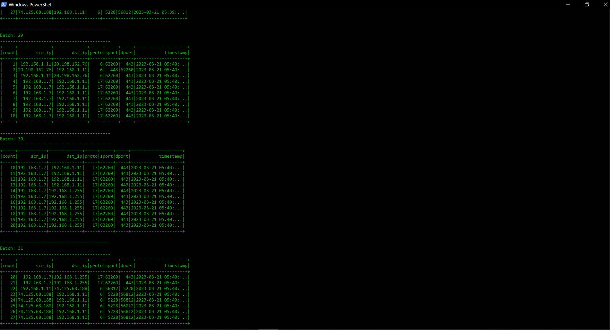

# Real time Network Analysis

This project was made using python 3.9.x, zookeeper, kafka and spark 3.3.0. 

## Details about the project

The projects aims for realtime network analysis using kafka and spark. Spark will act as consumer and listen to the kafka producer and the topic *pttest_pcap* and after every 2 seconds display the time sliding batch of network traffic. Kafka producer will read from a pcap file and simulate the network traffic and send data to Spark consumer. 

## Procedure

First of all, download the kafka .zip file using `curl` or `wget` command in linux or use the GUI. Navigate to the bin file of the kafka folder.

Now run the **zookeeper** service using

`./zookeeper-server-start.sh ../config/zookeeper.properties`

 and then run the **kafka** broker using

 `./kafka-server-start.sh ../config/server.properties`

 in another terminal. The kafka broker will now be running in port 9092.

Now navigate to ***Spark/** * and then run the following command of to run **spark consumer** in another terminal.

`spark-submit --packages org.spark:spark-sql-kafka-0-10_2.12:3.1.2 spark-consumer-pcap.py`

Now navigate to **Spark/RTS/** and run the kafka producer using python in another terminal.

`python3 pkt-producer-pcap.py`

Now go to the terminal where spark is running you will see that the spark is making batches of the incoming traffic just like it can be seen from the picture below

## References

Thanks to the blog written by [Rajaram Suryanarayanan](https://medium.com/@rajarams?source=---two_column_layout_sidebar----------------------------------) for helping me out

[https://medium.com/codex/streaming-live-network-packets-data-in-to-spark-streaming-using-kafka-25c8b5f58181](https://medium.com/codex/streaming-live-network-packets-data-in-to-spark-streaming-using-kafka-25c8b5f58181)
